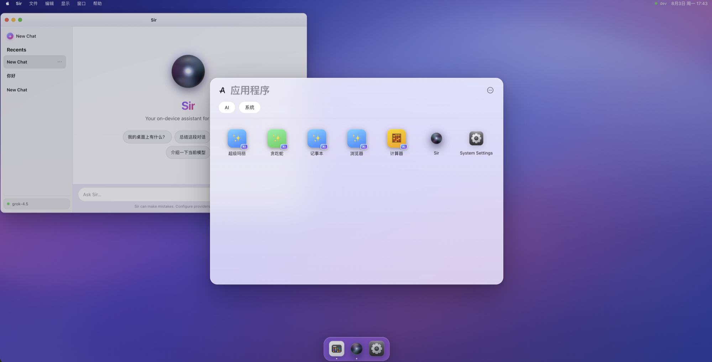

<p align="center">
  <a href="#zh-cn">简体中文</a> •
  <a href="#english">English</a>
</p>

<a id="zh-cn"></a>

<p align="center">
  
</p>

<h1 align="center">OpenOS</h1>

<p align="center">
  <b>Generate Everything, Create Infinite.</b><br />
  让想法直接成为正在运行的应用。
</p>

<p align="center">
  一个面向实时生成应用的 AI 桌面操作系统。<br />
  在启动台描述需求，让大模型现场生成可运行、可交互、可持续更新的应用；<br />
  关闭即安装，再次打开直接恢复。
</p>

<p align="center">
  <a href="https://github.com/seekskyworld/openos/actions/workflows/ci.yml"></a>
  <a href="LICENSE"></a>
  
  <a href="https://nodejs.org/"></a>
  <a href="https://www.electronjs.org/"></a>
  <a href="https://react.dev/"></a>
</p>

<p align="center">
  <a href="#zh-vision">开源愿景</a> ·
  <a href="#zh-screenshots">界面截图</a> ·
  <a href="#zh-features">核心特性</a> ·
  <a href="#zh-architecture">架构</a> ·
  <a href="#zh-quick-start">快速开始</a> ·
  <a href="#zh-contributing">参与贡献</a> ·
  <a href="#zh-links">相关链接</a>
</p>

<p align="center">
  
</p>

---

<a id="zh-vision"></a>

## 🌌 开源愿景：让应用在模型输出时就开始运行

大模型正在进入高速 Token 输出时代，但传统 AI 编程链路仍然要求模型先生成完整项目、安装依赖、编译，再把结果交给用户。模型越快，后面的工程等待越显得笨重。

OpenOS 想探索另一条开源路线：**不等待完整应用一次性交付，而是让生成过程本身成为应用的启动过程。** 模型先返回最小可运行界面，宿主立即渲染；随后以闭合、可校验的 HTML 阶段持续补齐内容与交互。通用样式、安全边界、窗口能力和可信行为由本地运行时提供，模型只生成真正属于这个应用的部分。

这条路线会分阶段推进：

| 阶段 | 用户体验 | 核心机制 |
| --- | --- | --- |
| 已知应用秒开 | 常见应用和历史生成结果即时出现 | 成品缓存、语义缓存、`AppRecipe`、可信本地引擎 |
| 冷生成快速首屏 | 模型尚未输出完，窗口已经可见 | `shell -> core -> content -> actions` 原子渐进 HTML、流式快照 |
| 生成即交互 | 页面补齐过程中即可点击、输入和运行 | 宿主 UI Kit、本地 Action Runtime、按需最小更新 |
| 高速模型实时应用 | 充分利用各厂商更高的 Token 速率 | 协议适配、流控、并发生成、增量校验与即时提交 |

“秒开”不应该只是先展示一个空壳来掩盖等待，而应该意味着：首个有用界面尽早出现，已经生成的部分立即可用，后续内容稳定地原地补齐。随着模型推理和输出速度继续提升，自然语言到可运行应用的距离会不断缩短，直到应用可以按想法实时出现。

最终，OpenOS 不只是一个固定应用集合，而是一套开放的生成式应用运行时：工具、内容、游戏、数据界面，乃至今天还没有名字的软件形态，都可以被现场组合出来。**一切皆有可能。**

---

<a id="zh-screenshots"></a>

## 界面截图

<p align="center">
  
</p>

---

<a id="zh-features"></a>

## ✨ 特性

### 🖥 macOS 风格桌面（纯前端实现，零图片资源）

- CSS 绘制的渐变壁纸、透明菜单栏（下拉菜单随聚焦应用变化）、毛玻璃 Dock
- 完整窗口系统：拖拽 / 红黄绿交通灯（关闭 · 抽屉式最小化到 Dock 缩略图 · 最大化）/ 点击背后窗口置顶 / 点击壁纸「显示桌面」四周散开
- 通知中心（点击菜单栏时间滑出：通知卡片 + 走秒的世界时钟）、应用数字角标、启动台（网格 / 列表、分类、搜索）
- 全局浅色 / 深色主题、中英文即时切换（统一 CSS 变量 + i18n）

### 🤖 Sir 助手

- Siri 风格玻璃光球动效（花瓣色块 bloom + 表面与内部流光）
- iMessage 风格深色聊天界面，多会话管理，SQLite 持久化，会话可删除

### 🪄 Gen Apps：搜索即生成应用

- 启动台输入关键词 -> 浏览器按已加载设置同步生成完整候选；Bridge API 为其他调用方复用同一策略（均不等待模型）
- 点击候选 -> **Cache-first Instant 生成**：成品缓存 -> AppRecipe/本地引擎 -> blueprint -> 单轮 Instant；仅显式精修模式进入最多 3 轮校验/修复
- 扫雷、数独、贪吃蛇命中 `AppRecipe + EngineRegistry`，毫秒组装并由可信本地规则/动画引擎运行，不调用模型
- 生成的应用运行在 CSP + sandbox iframe 中（无网络、无宿主访问）；关闭即安装进启动台，二次打开直接读库、不再调模型
- 搜索框可通过声明式 `web.search` 注入真实网络结果并用 `web.open` 打开正文；iframe 仍无公网权限，服务端固定搜索出口并安全提取网页纯文本
- 生成偏好滑杆四档：系统工具 -> 商店应用 -> 独立开发 -> 天马行空（同时映射提示词风格与采样温度）

### 🔌 多厂商 LLM 接入

- **llm-core 自有协议层**：内部统一请求协议（CoreRequest/CoreResponse）+ wire 适配器（OpenAI Chat / OpenAI Responses / Anthropic Messages / Google Gemini）+ 协议自动回退链
- 十余家提供商一键连接（OAuth / API Key），自定义端点支持多协议、多鉴权与真实模型列表拉取
- 未配置密钥时自动走本地 mock / fake 生成器，纯前端开发不依赖任何模型

<a id="zh-architecture"></a>

## 🏗 架构

```text
desktop      Electron 主进程 / preload / Bridge supervisor
web          React 桌面 UI（窗口系统 / 启动台 / Sir / 设置 / 通知中心）
server       本地 Bridge（loopback HTTP）
  ├─ llm-core     内部协议 -> 各厂商 wire 协议适配 + 回退链
  ├─ agent-core   任务无关的 coding-agent 循环内核（AgentTask<T> 注入）
  ├─ gen-apps     生成应用：Service / Repository / ArtifactCompiler / Validator
  └─ database     SQLite（WAL + 版本迁移）：会话消息 / 生成应用制品
packages/shared   前后端共享类型、线协议 schema、错误码
```

设计要点：

- **端口与适配器**：Suggestion / Artifact / Fragment / Cache / Runtime 都是独立端口，`GenerationOrchestrator` 负责缓存优先和并发合并，`create-server.ts` 只做组合根；fake / blueprint / llm / agentic 生成器可替换
- **agent-core 与任务解耦**：循环内核只懂「生成 -> 校验 -> 喂回 -> 修复」，HTML 应用只是一个 `AgentTask<string>` 实现；接入新的生成任务（SQL、图表、脚本等）只需再写一个任务包
- **安全**：生成代码经 ArtifactCompiler 重建外壳并注入 CSP，运行于 `sandbox="allow-scripts"` iframe；密钥只存在服务端，renderer 无 Node 权限
- **双端一致**：浏览器走 Vite 代理 `/api`，Electron 走 preload 注入的 apiBase + token，同一套 UI 与接口；dev / stable 通道数据隔离

<a id="zh-quick-start"></a>

## 🚀 快速开始

要求：Node.js >= 22（SQLite 使用内置 `node:sqlite`）

```bash
git clone https://github.com/seekskyworld/openos.git && cd openos
cp .env.example .env        # 可选：预填 LLM Key（也可稍后在设置界面配置）
npm install
npm run build

# 方式 A：浏览器（后端 + 前端 dev server）
npm run dev:web-stack
# 打开 http://127.0.0.1:5178

# 方式 B：Electron 桌面
npm run desktop:dev
```

`desktop:dev` 会自动构建主进程和内置 Bridge、启动 Vite 热更新服务并拉起 Electron；若 5178 已占用，会自动使用后续空闲端口。使用生产静态资源联调可运行 `npm run desktop:dev:static`。

桌面打包：

```bash
npm run desktop:pack          # 生成当前平台的未压缩应用目录，适合快速验收
npm run smoke:desktop-package # 启动打包应用，验证内置 Bridge 和渲染页
npm run desktop:dist          # 生成当前平台的安装包到 release/
```

安装包内置 Bridge 和运行时，不依赖用户预装 Node.js。当前本地构建默认不签名；正式分发时应在 CI 中配置对应平台的签名与公证凭据。

Web 部署压缩包：

```bash
npm run web:dist             # 生成 release/OpenOS-0.1.0-web.7z
npm run smoke:web-package    # 解压并验证界面、Bridge 代理和 SPA fallback
```

Web 包内含编译后的前端、已打包的本地 Bridge 和零依赖 Node.js 启动器，要求 Node.js 22 或更高版本，默认只监听 `127.0.0.1`。启动、数据、安全和回滚说明见 [Web 部署文档](docs/web-deployment.md)。

首次使用：打开 **系统设置 -> Providers** 连接一个模型提供商（OAuth 或 API Key），然后在 Dock 点 **App** 打开启动台，搜索任意关键词（如“计算器”）体验 AI 生成应用。

## ⚙️ 配置

| 途径 | 说明 |
| --- | --- |
| 设置界面 | Providers（OAuth / API Key + 模型选择）、自定义端点、生成偏好、外观、语言 |
| `.env` | 见 `.env.example`；UI 里的配置优先于环境变量 |
| 厂商标准 env | `OPENAI_API_KEY` / `ANTHROPIC_API_KEY` 等会被自动读取 |

数据目录（按通道隔离，密钥与数据只落在本机）：

| 端 | 路径 |
| --- | --- |
| Electron dev | `~/Library/Application Support/OpenOS Dev/data/` |
| Electron stable | `~/Library/Application Support/OpenOS/data/`（默认强制 bridge token） |
| 浏览器开发态 | 服务端工作目录下 `.openos/` |

## 📡 主要 API（本地 Bridge）

| 端点 | 说明 |
| --- | --- |
| `GET /api/health` · `GET /api/bootstrap` | 健康检查 / 运行时信息 |
| `POST /api/chat` | Sir 对话 |
| `GET/POST /api/threads*` | 会话与消息（SQLite） |
| `POST /api/gen-apps/suggestions` | 毫秒级生成应用候选（不调用 LLM） |
| `POST /api/gen-apps/drafts` | Coding Agent 生成应用（多轮） |
| `POST /api/gen-apps/:id/install` · `/launch` · `DELETE /:id` | 安装 / 打开 / 删除 |
| `GET /api/gen-apps/progress/:key` | 生成进度轮询 |
| `GET/PUT /api/settings/llm` · `/gen-apps` | 设置读写（密钥脱敏返回） |

## 🧭 开发

```bash
npm run typecheck        # 全部 workspace 类型检查
npm run build            # shared -> server -> web -> desktop
npx tsx server/scripts/smoke-agent-core-run.ts # agent 内核冒烟（5 路径）
OPENOS_GENAPPS_FAKE=1 npm run dev:server        # 无模型开发（确定性 fake 生成器）
```

设计文档见 [`docs/`](docs/)：Gen Apps 架构、Coding Agent 架构与实施文档。

<a id="zh-contributing"></a>

## 🤝 贡献

欢迎 Issue 与 PR。提交前请确保：

1. `npm run typecheck` 与 `npm run build` 通过；
2. 涉及生成应用安全面（ArtifactCompiler / Validator / 沙箱策略）的改动附带说明与冒烟结果；
3. UI 改动兼顾浅色与深色主题（统一使用 `--surface-*` / `--ink-*` / `--line-*` 主题变量）。

详见 [CONTRIBUTING.md](CONTRIBUTING.md)。使用 Coding Agent 贡献时请先阅读 [AGENTS.md](AGENTS.md)，其中定义了 Issue 关联、代码与架构文档同步、安全和验证规范。

社区协作遵循 [CODE_OF_CONDUCT.md](CODE_OF_CONDUCT.md)。安全漏洞请按 [SECURITY.md](SECURITY.md) 私密报告，不要创建公开 Issue。第三方依赖许可说明见 [docs/third-party-licenses.md](docs/third-party-licenses.md)。

<a id="zh-links"></a>

## Links

- [Releases](https://github.com/seekskyworld/openos/releases)
- [Issues](https://github.com/seekskyworld/openos/issues)
- [Security](https://github.com/seekskyworld/openos/security/policy)
- [Linux.do](https://linux.do/) - 社区讨论

## License

[Apache License 2.0](LICENSE)。再分发时请同时保留 [NOTICE](NOTICE)。

---

<p align="center">
  <a href="#zh-cn">简体中文</a> •
  <a href="#english">English</a>
</p>

<a id="english"></a>

<p align="center">
  
</p>

<h1 align="center">OpenOS</h1>

<p align="center">
  <b>Generate Everything, Create Infinite.</b><br />
  Turn ideas directly into running applications.
</p>

<p align="center">
  An AI desktop operating system for real-time generated applications.<br />
  Describe what you need in Launchpad and let an LLM generate a runnable, interactive app that can evolve in place.<br />
  Close it to install it; open it again to restore it instantly.
</p>

<p align="center">
  <a href="https://github.com/seekskyworld/openos/actions/workflows/ci.yml"></a>
  <a href="LICENSE"></a>
  
  <a href="https://nodejs.org/"></a>
  <a href="https://www.electronjs.org/"></a>
  <a href="https://react.dev/"></a>
</p>

<p align="center">
  <a href="#en-vision">Vision</a> ·
  <a href="#en-screenshots">Screenshots</a> ·
  <a href="#en-features">Features</a> ·
  <a href="#en-architecture">Architecture</a> ·
  <a href="#en-quick-start">Quick Start</a> ·
  <a href="#en-contributing">Contributing</a> ·
  <a href="#en-links">Links</a>
</p>

<p align="center">
  
</p>

---

<a id="en-vision"></a>

## 🌌 Open-source vision: applications should run while the model is still responding

LLMs are entering an era of high-speed token generation, but conventional AI coding workflows still wait for a complete project, dependency installation, and compilation before showing anything to the user. As models get faster, the engineering work queued behind them becomes increasingly conspicuous.

OpenOS explores a different open-source path: **generation itself becomes the application startup process instead of waiting for a complete app to arrive all at once.** The model first returns the smallest runnable interface, which the host renders immediately. It then fills in content and interactions through closed, verifiable HTML stages. Shared styles, security boundaries, window capabilities, and trusted behaviors come from the local runtime, so the model generates only what is unique to the application.

The roadmap advances in stages:

| Stage | User experience | Core mechanism |
| --- | --- | --- |
| Instant launch for known apps | Common apps and previous results appear immediately | Artifact cache, semantic cache, `AppRecipe`, and trusted local engines |
| Fast first screen for cold generation | The window is visible before the model finishes | Atomic progressive HTML (`shell -> core -> content -> actions`) and streaming snapshots |
| Interactive while generating | Generated portions can already be clicked, edited, and run | Host UI Kit, local Action Runtime, and minimal on-demand updates |
| Real-time apps on high-speed models | Higher token rates from every provider are fully utilized | Protocol adapters, flow control, concurrent generation, incremental validation, and immediate commits |

"Instant launch" should not mean hiding a wait behind an empty shell. It should mean that the first useful interface appears as early as possible, every completed part is immediately usable, and later content fills in place without destabilizing the page. As model reasoning and output continue to accelerate, the distance from natural language to a running application can keep shrinking until software appears in real time with the idea itself.

Ultimately, OpenOS is not a fixed collection of applications. It is an open generative application runtime where tools, content, games, data interfaces, and software forms that do not yet have names can be composed on demand. **Everything is possible.**

---

<a id="en-screenshots"></a>

## Screenshots

<p align="center">
  
</p>

---

<a id="en-features"></a>

## ✨ Features

### 🖥 macOS-style desktop (pure frontend implementation, no image assets)

- CSS-rendered gradient wallpaper, a transparent context-aware menu bar, and a glass Dock
- A complete window system: dragging, traffic-light controls (close, drawer-style minimize to a Dock thumbnail, maximize), click-to-focus, and a Show Desktop spread animation
- Notification Center with notification cards and live world clocks, app badges, and a Launchpad with grid/list views, categories, and search
- Instant light/dark theme and Chinese/English switching through shared CSS variables and i18n

### 🤖 Sir assistant

- Siri-inspired glass orb animation with petal blooms plus surface and internal light trails
- iMessage-inspired dark chat UI with multiple conversations, SQLite persistence, and conversation deletion

### 🪄 Gen Apps: search to generate applications

- Enter a keyword in Launchpad and the browser synchronously produces complete candidates from loaded settings; the Bridge API reuses the same policy for other clients, with neither path waiting for a model
- Select a candidate for **cache-first instant generation**: artifact cache -> AppRecipe/local engine -> blueprint -> one-pass Instant; only explicit refinement mode enters up to three validation and repair rounds
- Minesweeper, Sudoku, and Snake match `AppRecipe + EngineRegistry`, assemble in milliseconds, and run on trusted local rule and animation engines without calling a model
- Generated applications run inside CSP-protected sandbox iframes with no network or host access; closing installs them into Launchpad, and subsequent launches load directly from storage
- Search controls can inject real web results through declarative `web.search` actions and open extracted content through `web.open`; the iframe remains offline while the server uses fixed search egress and safely extracts plain text
- A four-level generation preference slider ranges from system utilities to store apps, indie software, and experimental ideas, mapping to prompt style and sampling temperature

### 🔌 Multi-provider LLM connectivity

- A provider-neutral **llm-core protocol layer** with unified `CoreRequest`/`CoreResponse` messages, wire adapters for OpenAI Chat, OpenAI Responses, Anthropic Messages, and Google Gemini, plus automatic protocol fallback
- One-click connections for more than ten providers through OAuth or API keys; custom endpoints support multiple protocols, authentication schemes, and live model discovery
- A local mock/fake generator is used when no key is configured, so frontend development does not depend on any model

<a id="en-architecture"></a>

## 🏗 Architecture

```text
desktop      Electron main process / preload / Bridge supervisor
web          React desktop UI (window system / Launchpad / Sir / Settings / Notification Center)
server       Local Bridge (loopback HTTP)
  |- llm-core     Internal protocol -> provider wire adapters + fallback chain
  |- agent-core   Task-agnostic coding-agent loop (`AgentTask<T>` injection)
  |- gen-apps     Generated apps: Service / Repository / ArtifactCompiler / Validator
  `- database     SQLite (WAL + migrations): conversations / generated artifacts
packages/shared   Cross-process types, wire schemas, and error codes
```

Key design decisions:

- **Ports and adapters:** Suggestion, Artifact, Fragment, Cache, and Runtime are independent ports. `GenerationOrchestrator` owns cache-first selection and in-flight request coalescing, while `create-server.ts` remains the composition root. Fake, blueprint, LLM, and agentic generators are replaceable.
- **Task-agnostic agent-core:** the loop only knows how to generate, validate, feed errors back, and repair. An HTML application is one `AgentTask<string>` implementation; another task package can add SQL, charts, scripts, or other generated artifacts.
- **Security:** `ArtifactCompiler` rebuilds generated code into a controlled shell and injects CSP. Applications run in `sandbox="allow-scripts"` iframes, secrets remain server-side, and the renderer has no Node.js privileges.
- **Consistent browser and desktop clients:** the browser proxies `/api` through Vite, while Electron receives `apiBase` and a token through preload. Both use the same UI and HTTP contract, with isolated dev and stable data channels.

<a id="en-quick-start"></a>

## 🚀 Quick Start

Requirement: Node.js >= 22 (`node:sqlite` is built in)

```bash
git clone https://github.com/seekskyworld/openos.git && cd openos
cp .env.example .env        # Optional: prefill an LLM key, or configure it later in Settings
npm install
npm run build

# Option A: browser (backend + frontend dev server)
npm run dev:web-stack
# Open http://127.0.0.1:5178

# Option B: Electron desktop
npm run desktop:dev
```

`desktop:dev` builds the main process and bundled Bridge, starts the Vite hot-reload server, and launches Electron. If port 5178 is occupied, it automatically selects the next available port. Use `npm run desktop:dev:static` to test against production static assets.

Desktop packaging:

```bash
npm run desktop:pack          # Build an unpacked app for the current platform
npm run smoke:desktop-package # Launch the packaged app and verify its Bridge and renderer
npm run desktop:dist          # Create installers in release/
```

Packaged applications contain the Bridge and runtime and do not require Node.js on the user's machine. Local builds are unsigned by default; production distribution should configure platform signing and notarization credentials in CI.

Web deployment archive:

```bash
npm run web:dist             # Build release/OpenOS-0.1.0-web.7z
npm run smoke:web-package    # Extract it and verify the UI, Bridge proxy, and SPA fallback
```

The Web archive contains the compiled frontend, a bundled local Bridge, and a zero-dependency Node.js launcher. It requires Node.js 22 or newer and binds to `127.0.0.1` by default. See [Web deployment](docs/web-deployment.md) for startup, data, security, and rollback guidance.

On first use, open **System Settings -> Providers** and connect a model provider through OAuth or an API key. Then click **App** in the Dock, open Launchpad, and search for anything, such as "calculator", to generate an application.

## ⚙️ Configuration

| Source | Description |
| --- | --- |
| Settings UI | Providers (OAuth/API key and model selection), custom endpoints, generation preferences, appearance, and language |
| `.env` | See `.env.example`; settings saved through the UI take precedence |
| Provider environment variables | Standard variables such as `OPENAI_API_KEY` and `ANTHROPIC_API_KEY` are detected automatically |

Data directories are isolated by channel, and secrets and application data remain on the local machine:

| Client | Path |
| --- | --- |
| Electron dev | `~/Library/Application Support/OpenOS Dev/data/` |
| Electron stable | `~/Library/Application Support/OpenOS/data/` (Bridge token required by default) |
| Browser development | `.openos/` under the server working directory |

## 📡 Main API (local Bridge)

| Endpoint | Description |
| --- | --- |
| `GET /api/health` · `GET /api/bootstrap` | Health check / runtime metadata |
| `POST /api/chat` | Sir chat |
| `GET/POST /api/threads*` | Conversations and messages (SQLite) |
| `POST /api/gen-apps/suggestions` | Millisecond-scale application candidates without an LLM call |
| `POST /api/gen-apps/drafts` | Multi-round Coding Agent application generation |
| `POST /api/gen-apps/:id/install` · `/launch` · `DELETE /:id` | Install / launch / delete |
| `GET /api/gen-apps/progress/:key` | Generation progress polling |
| `GET/PUT /api/settings/llm` · `/gen-apps` | Read/write settings with redacted secrets |

## 🧭 Development

```bash
npm run typecheck        # Type-check every workspace
npm run build            # shared -> server -> web -> desktop
npx tsx server/scripts/smoke-agent-core-run.ts # Smoke-test five agent-core paths
OPENOS_GENAPPS_FAKE=1 npm run dev:server        # Deterministic, model-free generator
```

See [`docs/`](docs/) for the Gen Apps architecture and the Coding Agent architecture and implementation guides.

<a id="en-contributing"></a>

## 🤝 Contributing

Issues and pull requests are welcome. Before submitting, make sure that:

1. `npm run typecheck` and `npm run build` pass;
2. changes to the generated-application security surface (`ArtifactCompiler`, `Validator`, or sandbox policy) include a threat-model note and smoke-test evidence;
3. UI changes work in both light and dark themes and use the shared `--surface-*`, `--ink-*`, and `--line-*` theme variables.

See [CONTRIBUTING.md](CONTRIBUTING.md) for the full guide. Coding Agents must also read [AGENTS.md](AGENTS.md), which defines Issue traceability, code and architecture documentation synchronization, security requirements, and verification rules.

Community collaboration follows the [Code of Conduct](CODE_OF_CONDUCT.md). Report vulnerabilities privately according to [SECURITY.md](SECURITY.md), never through a public Issue. Third-party license notices are listed in [docs/third-party-licenses.md](docs/third-party-licenses.md).

<a id="en-links"></a>

## Links

- [Releases](https://github.com/seekskyworld/openos/releases)
- [Issues](https://github.com/seekskyworld/openos/issues)
- [Security](https://github.com/seekskyworld/openos/security/policy)
- [Linux.do](https://linux.do/) - community discussion

## License

[Apache License 2.0](LICENSE). Redistributions must also retain [NOTICE](NOTICE).
