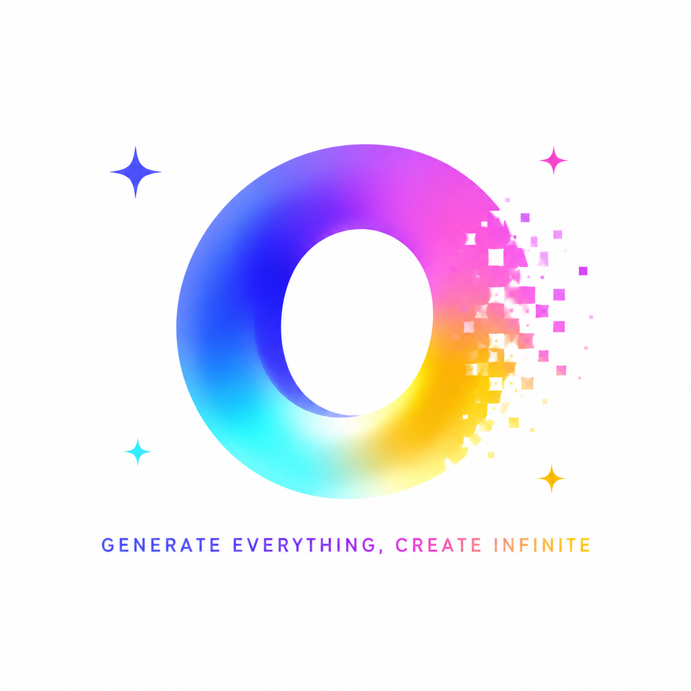

<p align="center">
  <a href="README-zh_CN.md">简体中文</a> •
  <a href="README.md">English</a>
</p>

<p align="center">
  
</p>

<h1 align="center">OpenOS</h1>

<p align="center">
  <b>Generate Everything, Create Infinite.</b><br />
  Turn ideas directly into running applications.
</p>

<p align="center">
  An AI desktop operating system for real-time generated applications.<br />
  Describe what you need in Launchpad and let an LLM generate a runnable, interactive app that can evolve in place.<br />
  Close it to install it; open it again to restore it instantly.
</p>

<p align="center">
  <a href="https://github.com/seekskyworld/openos/actions/workflows/ci.yml"></a>
  <a href="LICENSE"></a>
  
  <a href="https://nodejs.org/"></a>
  <a href="https://www.electronjs.org/"></a>
  <a href="https://react.dev/"></a>
</p>

<p align="center">
  <a href="#vision">Vision</a> ·
  <a href="#features">Features</a> ·
  <a href="#architecture">Architecture</a> ·
  <a href="#quick-start">Quick Start</a> ·
  <a href="#contributing">Contributing</a> ·
  <a href="#links">Links</a>
</p>

<p align="center">
  
</p>

---

<a id="vision"></a>

## 🌌 Open-source vision: applications should run while the model is still responding

LLMs are entering an era of high-speed token generation, but conventional AI coding workflows still wait for a complete project, dependency installation, and compilation before showing anything to the user. As models get faster, the engineering work queued behind them becomes increasingly conspicuous.

OpenOS explores a different open-source path: **generation itself becomes the application startup process instead of waiting for a complete app to arrive all at once.** The model first returns the smallest runnable interface, which the host renders immediately. It then fills in content and interactions through closed, verifiable HTML stages. Shared styles, security boundaries, window capabilities, and trusted behaviors come from the local runtime, so the model generates only what is unique to the application.

The roadmap advances in stages:

| Stage | User experience | Core mechanism |
| --- | --- | --- |
| Instant launch for known apps | Common apps and previous results appear immediately | Artifact cache, semantic cache, `AppRecipe`, and trusted local engines |
| Fast first screen for cold generation | The window is visible before the model finishes | Atomic progressive HTML (`shell -> core -> content -> actions`) and streaming snapshots |
| Interactive while generating | Generated portions can already be clicked, edited, and run | Host UI Kit, local Action Runtime, and minimal on-demand updates |
| Real-time apps on high-speed models | Higher token rates from every provider are fully utilized | Protocol adapters, flow control, concurrent generation, incremental validation, and immediate commits |

"Instant launch" should not mean hiding a wait behind an empty shell. It should mean that the first useful interface appears as early as possible, every completed part is immediately usable, and later content fills in place without destabilizing the page. As model reasoning and output continue to accelerate, the distance from natural language to a running application can keep shrinking until software appears in real time with the idea itself.

Ultimately, OpenOS is not a fixed collection of applications. It is an open generative application runtime where tools, content, games, data interfaces, and software forms that do not yet have names can be composed on demand. **Everything is possible.**

---

<a id="features"></a>

## ✨ Features

### 🖥 macOS-style desktop (pure frontend implementation, no image assets)

- CSS-rendered gradient wallpaper, a transparent context-aware menu bar, and a glass Dock
- A complete window system: dragging, traffic-light controls (close, drawer-style minimize to a Dock thumbnail, maximize), click-to-focus, and a Show Desktop spread animation
- Notification Center with notification cards and live world clocks, app badges, and a Launchpad with grid/list views, categories, and search
- Instant light/dark theme and Chinese/English switching through shared CSS variables and i18n

### 🤖 Sir assistant

- Siri-inspired glass orb animation with petal blooms plus surface and internal light trails
- iMessage-inspired dark chat UI with multiple conversations, SQLite persistence, and conversation deletion

### 🪄 Gen Apps: search to generate applications

- Enter a keyword in Launchpad and the browser synchronously produces complete candidates from loaded settings; the Bridge API reuses the same policy for other clients, with neither path waiting for a model
- Select a candidate for **cache-first instant generation**: artifact cache -> AppRecipe/local engine -> blueprint -> one-pass Instant; only explicit refinement mode enters up to three validation and repair rounds
- Minesweeper, Sudoku, and Snake match `AppRecipe + EngineRegistry`, assemble in milliseconds, and run on trusted local rule and animation engines without calling a model
- Generated applications run inside CSP-protected sandbox iframes with no network or host access; closing installs them into Launchpad, and subsequent launches load directly from storage
- Search controls can inject real web results through declarative `web.search` actions and open extracted content through `web.open`; the iframe remains offline while the server uses fixed search egress and safely extracts plain text
- A four-level generation preference slider ranges from system utilities to store apps, indie software, and experimental ideas, mapping to prompt style and sampling temperature

### 🔌 Multi-provider LLM connectivity

- A provider-neutral **llm-core protocol layer** with unified `CoreRequest`/`CoreResponse` messages, wire adapters for OpenAI Chat, OpenAI Responses, Anthropic Messages, and Google Gemini, plus automatic protocol fallback
- One-click connections for more than ten providers through OAuth or API keys; custom endpoints support multiple protocols, authentication schemes, and live model discovery
- A local mock/fake generator is used when no key is configured, so frontend development does not depend on any model

<a id="architecture"></a>

## 🏗 Architecture

```text
desktop      Electron main process / preload / Bridge supervisor
web          React desktop UI (window system / Launchpad / Sir / Settings / Notification Center)
server       Local Bridge (loopback HTTP)
  |- llm-core     Internal protocol -> provider wire adapters + fallback chain
  |- agent-core   Task-agnostic coding-agent loop (`AgentTask<T>` injection)
  |- gen-apps     Generated apps: Service / Repository / ArtifactCompiler / Validator
  `- database     SQLite (WAL + migrations): conversations / generated artifacts
packages/shared   Cross-process types, wire schemas, and error codes
```

Key design decisions:

- **Ports and adapters:** Suggestion, Artifact, Fragment, Cache, and Runtime are independent ports. `GenerationOrchestrator` owns cache-first selection and in-flight request coalescing, while `create-server.ts` remains the composition root. Fake, blueprint, LLM, and agentic generators are replaceable.
- **Task-agnostic agent-core:** the loop only knows how to generate, validate, feed errors back, and repair. An HTML application is one `AgentTask<string>` implementation; another task package can add SQL, charts, scripts, or other generated artifacts.
- **Security:** `ArtifactCompiler` rebuilds generated code into a controlled shell and injects CSP. Applications run in `sandbox="allow-scripts"` iframes, secrets remain server-side, and the renderer has no Node.js privileges.
- **Consistent browser and desktop clients:** the browser proxies `/api` through Vite, while Electron receives `apiBase` and a token through preload. Both use the same UI and HTTP contract, with isolated dev and stable data channels.

<a id="quick-start"></a>

## 🚀 Quick Start

Requirement: Node.js >= 22 (`node:sqlite` is built in)

```bash
git clone https://github.com/seekskyworld/openos.git && cd openos
cp .env.example .env        # Optional: prefill an LLM key, or configure it later in Settings
npm install
npm run build

# Option A: browser (backend + frontend dev server)
npm run dev:web-stack
# Open http://127.0.0.1:5178

# Option B: Electron desktop
npm run desktop:dev
```

`desktop:dev` builds the main process and bundled Bridge, starts the Vite hot-reload server, and launches Electron. If port 5178 is occupied, it automatically selects the next available port. Use `npm run desktop:dev:static` to test against production static assets.

Desktop packaging:

```bash
npm run desktop:pack          # Build an unpacked app for the current platform
npm run smoke:desktop-package # Launch the packaged app and verify its Bridge and renderer
npm run desktop:dist          # Create installers in release/
```

Packaged applications contain the Bridge and runtime and do not require Node.js on the user's machine. Local builds are unsigned by default; production distribution should configure platform signing and notarization credentials in CI.

On first use, open **System Settings -> Providers** and connect a model provider through OAuth or an API key. Then click **App** in the Dock, open Launchpad, and search for anything, such as "calculator", to generate an application.

## ⚙️ Configuration

| Source | Description |
| --- | --- |
| Settings UI | Providers (OAuth/API key and model selection), custom endpoints, generation preferences, appearance, and language |
| `.env` | See `.env.example`; settings saved through the UI take precedence |
| Provider environment variables | Standard variables such as `OPENAI_API_KEY` and `ANTHROPIC_API_KEY` are detected automatically |

Data directories are isolated by channel, and secrets and application data remain on the local machine:

| Client | Path |
| --- | --- |
| Electron dev | `~/Library/Application Support/OpenOS Dev/data/` |
| Electron stable | `~/Library/Application Support/OpenOS/data/` (Bridge token required by default) |
| Browser development | `.openos/` under the server working directory |

## 📡 Main API (local Bridge)

| Endpoint | Description |
| --- | --- |
| `GET /api/health` · `GET /api/bootstrap` | Health check / runtime metadata |
| `POST /api/chat` | Sir chat |
| `GET/POST /api/threads*` | Conversations and messages (SQLite) |
| `POST /api/gen-apps/suggestions` | Millisecond-scale application candidates without an LLM call |
| `POST /api/gen-apps/drafts` | Multi-round Coding Agent application generation |
| `POST /api/gen-apps/:id/install` · `/launch` · `DELETE /:id` | Install / launch / delete |
| `GET /api/gen-apps/progress/:key` | Generation progress polling |
| `GET/PUT /api/settings/llm` · `/gen-apps` | Read/write settings with redacted secrets |

## 🧭 Development

```bash
npm run typecheck        # Type-check every workspace
npm run build            # shared -> server -> web -> desktop
npx tsx server/scripts/smoke-agent-core-run.ts # Smoke-test five agent-core paths
OPENOS_GENAPPS_FAKE=1 npm run dev:server        # Deterministic, model-free generator
```

See [`docs/`](docs/) for the Gen Apps architecture and the Coding Agent architecture and implementation guides.

<a id="contributing"></a>

## 🤝 Contributing

Issues and pull requests are welcome. Before submitting, make sure that:

1. `npm run typecheck` and `npm run build` pass;
2. changes to the generated-application security surface (`ArtifactCompiler`, `Validator`, or sandbox policy) include a threat-model note and smoke-test evidence;
3. UI changes work in both light and dark themes and use the shared `--surface-*`, `--ink-*`, and `--line-*` theme variables.

See [CONTRIBUTING.md](CONTRIBUTING.md) for the full guide. Coding Agents must also read [AGENTS.md](AGENTS.md), which defines Issue traceability, code and architecture documentation synchronization, security requirements, and verification rules.

Community collaboration follows the [Code of Conduct](CODE_OF_CONDUCT.md). Report vulnerabilities privately according to [SECURITY.md](SECURITY.md), never through a public Issue. Third-party license notices are listed in [docs/third-party-licenses.md](docs/third-party-licenses.md).

<a id="links"></a>

## Links

- [Releases](https://github.com/seekskyworld/openos/releases)
- [Issues](https://github.com/seekskyworld/openos/issues)
- [Security](https://github.com/seekskyworld/openos/security/policy)
- [Linux.do](https://linux.do/) - community discussion

## License

[Apache License 2.0](LICENSE). Redistributions must also retain [NOTICE](NOTICE).
